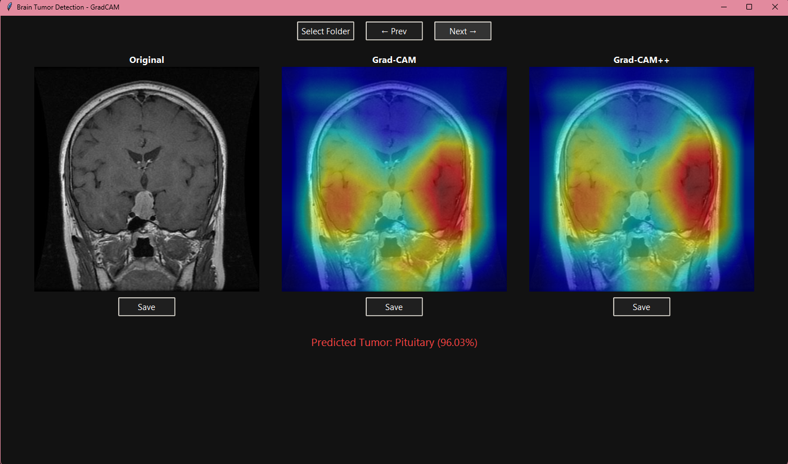

# Brain Tumor Detection with GradCAM (Tkinter Desktop App)

A lightweight desktop application to detect brain tumors from MRI scans using a DenseNet121 model. It provides visual explanations using GradCAM and GradCAM++ directly on a dark-themed Tkinter interface.

---

## Table of Contents

- [Features](#features)
- [Model Details](#model-details)
- [Installation](#installation)
- [Usage](#usage)
- [Screenshot](#screenshot)


---

## Features

- Folder-based image selection for batch viewing
- Image classification into:
  - Glioma
  - Meningioma
  - Pituitary
  - No Tumor
- Visualizations using GradCAM and GradCAM++
- Previous/Next image navigation
- Dynamically resizes images to fit the window
- Save visualizations with a file dialog
- Clean, dark-themed interface with styled buttons

---
## Screenshot



## Model Details

- **Architecture**: DenseNet121
- **Classes**: Glioma, Meningioma, Pituitary, No Tumor
- **Input Size**: 384x384
- **Framework**: PyTorch
- **Preprocessing**:
  - Grayscale to RGB
  - Normalized to mean=0.5, std=0.5


---

## Installation

1. Clone the repository:
   ```bash
   git clone https://github.com/your-username/brain-tumor-gradcam-tkinter.git
   cd brain-tumor-gradcam-tkinter
2. Install Dependencies

    ```bash
    pip install -r requirements.txt
OR

  ```bash
      pip install torch torchvision pillow opencv-python numpy pytorch-grad-cam
3. Run
      python gui_app.py


